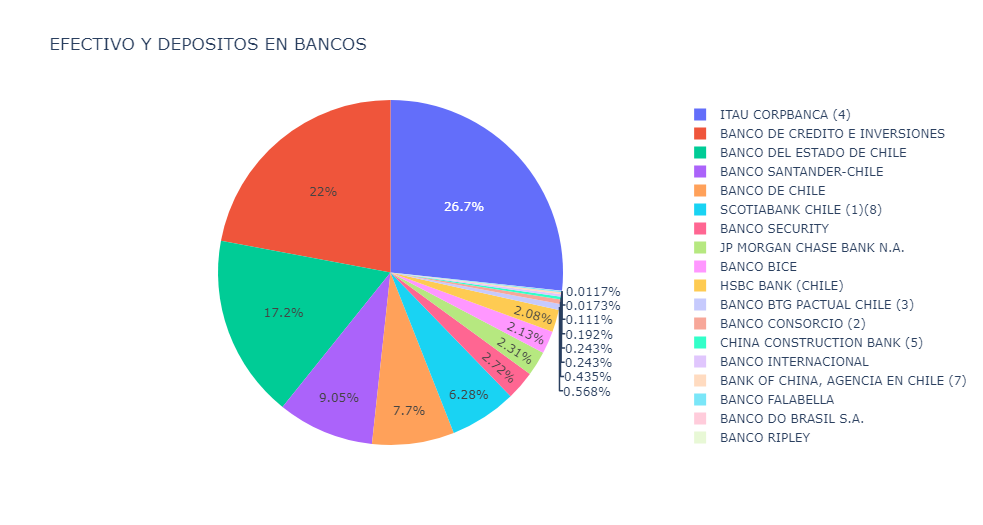

# Chilean Banks Benchmark
This challenge is supposed to gather data from the [CMF Chile](https://www.cmfchile.cl/portal/estadisticas/617/w3-propertyvalue-28917.html). In this case the data is going to be downloaded by hand, avoiding use webscraping, because I do not know about any law that could deny it.  
After gathering all the data, I am going to show it using different kind of chart.

## Technologies used:
- Jupyter Lab
- Environment with:  
    - Python 3.10.8    
    - plotly 5.9.0  
    - Pandas 1.5.2  

## Diagram: 

### Graph.ipynb Output:

## Final thoughts
All the .parquet created shold be uploaded to a S3 Bucket. You could do it just by installing AWS CLI on your computer.  

After installing it, you should configure it by aws configure and then you should insert your keys. (To create a key you should do it by AWS IAM).

Finally, if you have been able to follow the previous steps, you could do:   

`aws s3 cp [parquetFolder] [BucketS3]`
  
If you would like to query this data from dbeaver, you should add it to the data catalog. So, you should create a AWS Crawler and run it :smiley:
